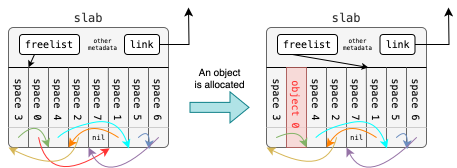
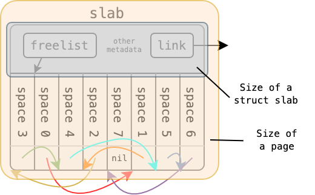

<div align="center">
  <h1>📖 MP2 Implementation Guide: Slab Allocator</h1>
  <h3>Technical Details and Implementation Logic</h3>
</div>

## 📋 Table of Contents

- [🧠 Technical Background](#-technical-background)
- [📁 System Integration: Why Slab for File Objects?](#-system-integration-why-slab-for-file-objects)
- [💡 Implementation Guide](#-implementation-guide)
  - [Initial Design of the Slab Allocator](#initial-design-of-the-slab-allocator)
  - [Contiguous Memory Model of `freelist`](#contiguous-memory-model-of-freelist)
  - [Layout and Relationships of System Components](#layout-and-relationships-of-system-components)
- [🐧 Linux Styled List API](#-linux-styled-list-api)
- [🔒 Concurrency and Synchronization](#-concurrency-and-synchronization)
- [🛡️ Randomized Freelist](#️-randomized-freelist)
- [✨ Advanced Challenge: O(1) Operations](#-advanced-challenge-o1-operations)

## 🧠 Technical Background

Consider a scenario where the kernel needs to allocate memory for 100 `struct file`s, each sized `40B`. Allocating a full 4KB page for each would not only involve high initialization overhead but also lead to severe **Internal Fragmentation**.

To maximize space utilization and allocation speed, the kernel can pre-allocate a full page and partition it into fixed-size `40B` chunks.

> 
>
> This is a classic mechanism originating from SunOS and later adopted by Linux to optimize small object allocation. Fun fact: The research lab that your MP2 TAs are part of is abbreviated as NEWSLAB, which can be interpreted as "NewSlab" — the very goal of this assignment! Well... hope that wasn't too cold of a joke.

## 📁 System Integration: Why Slab for File Objects?

In a typical Unix-like system, `struct file` is one of the most frequently allocated and deallocated structures. Every time a process calls `open()`, `pipe()`, or `dup()`, the kernel needs a new `struct file` object.

The standard `xv6` uses a fixed-size static array (`ftable`) to store these objects. This approach has several drawbacks:
1. **Hard Limits**: Once the `NFILE` limit is reached, no more files can be opened, even if the system has plenty of free memory.
2. **Inflexibility**: Memory for `NFILE` structures is reserved at boot time, regardless of whether they are actually used.
3. **Linear Search**: Finding a free slot in a static array often requires an $O(n)$ linear scan.

By integrating your **Slab Allocator** into `kernel/file.c`, you are moving towards a more modern kernel architecture. The slab allocator provides:
- **Dynamic Growth**: The kernel can open as many files as physical memory allows.
- **Improved Performance**: Allocation and deallocation become $O(1)$ operations with better cache locality.
- **Reduced Fragmentation**: Slabs pack objects tightly within pages, minimizing waste.

This task is not just about writing an allocator; it is about **transforming the kernel's memory management model** to be more scalable and robust.

## 💡 Implementation Guide

### Initial Design of the Slab Allocator

To simplify the problem, we stipulate that **the system can only request a single page from `kalloc()` at a time**. We need to define `struct slab` to manage the respective slices within a single page, and declare a `struct kmem_cache` to serve as the "chief manager" for slabs of the same type.

```c
struct slab {
    void **freelist; // Points to available space
    ... 
};

struct kmem_cache {
    char name[MP2_CACHE_MAX_NAME]; // e.g.: "file"
    uint object_size;              // e.g.: sizeof(struct file)
    <link> slab_head_1;            // <link> can be a pointer, linked list, etc. (Can freely choose the suitable approach to implement)
    ... 
};
```

### Contiguous Memory Model of `freelist`

After slicing up a full page, how do we keep track of "which spaces are empty"?

Linux developers utilized a type-casting technique: since these memory slots are currently "empty," we can **treat the first 8 bytes of each free slot as a pointer to the next available one**. This creates a zero-overhead linked list for the `freelist`.

```c
struct slab *s = ...;
// Get the first available free object
void *free_obj = s->freelist;
// The first 8 bytes of free_obj points to the next free slot
void *next_free_obj = *(void **)free_obj; 
// Once you are ready to allocate it to the user, cast it to the requested type
struct file *f = (struct file *) free_obj;
```

Alternatively, refer to the elegant design pattern already provided in `xv6`'s `kalloc.c`:

```c
// Treat memory as a struct with a next member
struct run {
    struct run *next;
};

struct slab {
    struct run *freelist;
    ...
};

// Access and step forward
struct run *r = s->freelist;
struct run *r_next = r->next;
struct file *f = (struct file *) r;
```

### Layout and Relationships of System Components

#### Responsibilities and Layout of `struct slab`

Each slab occupies a 4KB physical page. The page begins with `struct slab` metadata, with the remaining space partitioned into object blocks (linked via the `freelist`).
Depending on the number of available objects, a slab exists in one of three states: **full**, **partial**, or **free**.



> Illustration: State changes of a free slab before/after allocating one object.

Please precisely use **Pointer Arithmetic** to pinpoint the starting address of each space:




## 🐧 Linux Styled List API ([`list.h`](../kernel/list.h))

Linux uses a unique linked list implementation defined in `include/linux/list.h`. Unlike traditional linked lists that store data inside a node, Linux **embeds the list node inside the data structure**.

### Intrusive vs. Non-intrusive Lists

- **Non-intrusive (Standard)**: `struct node { void *data; struct node *next; };`
- **Intrusive (Linux)**: `struct slab { struct list_head list; ... };`

This approach allows a single structure to be part of multiple lists without extra memory allocations.

### `container_of` Magic

How do we get back to the `struct slab` from a `struct list_head *`? We use the `container_of` macro (or `list_entry`):

```c
struct list_head *ptr = ...;
struct slab *s = list_entry(ptr, struct slab, list);
```

This macro uses pointer arithmetic and the `offsetof` operator to calculate the starting address of the parent structure.

For the bonus requirements, you should use this pattern to manage the slab lists in your `struct kmem_cache`. See [MP2 Main Document](./mp2.md#-linux-list-api-application-bonus-5) for grading details.

## 🔒 Concurrency and Synchronization

On a multi-core system, concurrent `alloc` or `free` calls may corrupt linked lists. Ensure you use the **spinlocks** provided by xv6 in critical sections:

```c
// Example 1: slab.c
void *kmem_cache_api(struct kmem_cache *cache) {
    acquire(&cache->lock);
    if (...) {
        release(&cache->lock); // CRITICAL: Release before returning due to error
        return 0;
    }
    struct slab *s = ...;
    void *obj = s->freelist;
    // ... update freelist and links ...
    release(&cache->lock); // CRITICAL: Release before successful return
    return obj;
}

// Example 2: file.c
struct spinlock my_file_lock; // init with initlock, you can also reuse the lock in kmem_cache
void fileclose(struct file *f) {
    acquire(&my_file_lock);
    if (...) {
        // ...
        release(&my_file_lock); // Release inside the branch
        return;
    }
    release(&my_file_lock);
    // Finally, free the object back to the slab cache
    kmem_cache_free(file_cache, f);
}
```

## 🛡️ Randomized Freelist

When you create a new Slab and initialize the `freelist` links between the partitioned chunks, the pointing order between objects **should not be linear**. This prevents attackers from predicting the memory layout of the kernel.

### Why Randomize?

In modern operating systems, the allocation behavior of kernel memory is a major focus for security research. If the kernel always allocates memory in a highly predictable, linear fashion (e.g., from low to high addresses), an attacker can predict the exact locations of specific structures (like `struct file`). This predictability allows for techniques like **Heap Spraying** or **Heap Grooming**, where malicious data is precisely placed at known offsets to exploit buffer overflows or hijack control flow.

By **randomizing the `freelist`**, the kernel ensures that the resulting memory layout is non-deterministic, even if an attacker triggers multiple allocations. This "probabilistic defense" significantly raises the bar for successful exploitation.

### Implementation Strategies

The core goal is to ensure that the `next` pointers within a newly created slab form a **Random Permutation** of the available object slots.

1. **Shuffling Algorithms**: The most common approach is the **Fisher-Yates Shuffle** (also known as the Knuth Shuffle). It produces a statistically unbiased permutation in $O(n)$ time. You can also use other shuffling algorithms, but they must be statistically unbiased.
2. **Entropy Sources**: A shuffle is only as good as its seed. In a kernel environment, you might consider using hardware-based non-deterministic factors (like CPU cycle counters via `rdtsc` or timing jitter) to introduce "true" randomness into your allocator's initialization phase.

### Verification: Entropy and Inversions

How can we mathematically "measure" randomness? The grading framework uses the concept of **Inversions** from combinatorial mathematics to evaluate the entropy of your `freelist`.

- **What is an Inversion?**: In a sequence $P$, an inversion is a pair of indices $(i, j)$ such that $i < j$ but $P(i) > P(j)$. 
- **Statistical Logic (Example: $N=8$ Slab)**:
  - **Total Permutations**: $8! = 40,320$ possibilities.
  - **Inversion Range**: 0 for a perfectly sorted list (linear); $\binom{8}{2} = 28$ for a perfectly reversed list (too regular).
  - **Mahonian Numbers**: Random permutations follow a symmetric bell-shaped distribution of inversions ("Mahonian numbers") with a mean of 14.
- **The [8, 20] Threshold - Why?**:
  - **Lower Bound (8)**: This identifies sequences that are "too sorted." If your inversion count is below 8, it means your shuffling is either missing or too weak.
  - **Upper Bound (20)**: This identifies sequences that are "too regular" in the opposite direction. For example, a purely descending list has 28 inversions, which is just as predictable as a sorted one.
  - **Statistical Confidence**: In a truly random generator, the probability of a single trial falling within $[8, 20]$ is approximately **89.13%**.
- **Binomial Stability Test**:
  To account for rare edge cases, the framework performs **10 independent trials**. According to the binomial distribution, a healthy random generator has an over **99.4%** probability of passing at least **5 out of 10** trials.

By utilizing these rigorous metrics, we can effectively distinguish "true randomization" from simple deterministic patterns.

For more details on the scoring and validation criteria, please refer to the [MP2 Main Document](./mp2.md#-allocation-randomization-bonus-10).

## ✨ Advanced Challenge: O(1) Operations

While the standard implementation of a slab allocator is sufficient, **achieving strict O(1) time complexity for `kmem_cache_create`, `kmem_cache_alloc`, and `kmem_cache_free` is entirely possible**, and which is why the slab allocator is widely used in modern operating systems.

We encourage students who are interested in performance optimization and kernel design to try and implement a fully O(1) slab allocator. Good luck!
